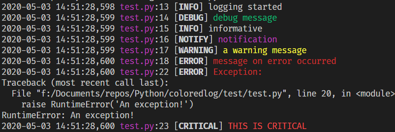

Colorize your console output.  
Provides `ConsoleHandler()` for working with `logging` module to get colored logging message.

# Usage Example
## 1. Colorize your logging output
```python
# you can just do `from colorlog import *`
import logging, colorlog
logger = logging.getLogger(__name__)
logger.addHandler(colorlog.ConsoleHandler())

logger.setLevel(logging.DEBUG)
logger.debug('debug')
logger.info('info')
logger.log(colorlog.NOTIFY, 'notification') # new log level defined in `colorlogger`
logger.warning('warning')
logger.error('error')
try:
    raise 'An exception!'
except:
    logger.exception('exception')
logger.critical('critical')

```
**Result on Windows 10**



## 2. Decorate your normal message
```python
from colorlogger.color import *

print(deco('Hello, ', 0x011, bold=True) + reset() + 'world!')
print(deco('Hello, ', reverse=True) + reset() + 'world!')
print(deco('Hello, ', FG_BLUE, bold=True) + reset() + 'world!')
print(deco('Hello, ', FG_YELLOW, BG_GREEN, bold=True) + reset() + 'world!')
print(deco('Hello, ', FG_MAGENTA, bold=True) + reset() + 'w...')

# Simple convenience functions
warning("emmm, seems there is a small proble...")
error('Unknown error!')
```
_For more infomation on parameter rules for deco( ), please refer to the docstring._

**Result on Windows 10**


## 3. For **intensive** use case 
Since a complete run-through of `deco()` can be a bit time-consuming under intensive use case, you may consider method below to speed up the operation of `deco()`
```python
from colorlogger.color import *

const_deco = deco('', FG_BLUE, BG_WHITE, bold=True)
# simulates intensive use case
for i in range(10):
    print(deco('Hello world for {} times'.format(i), const_deco=const_deco)) # `deco()` will return immediately

print(reset()) # reset to normal color
```
**Result on Windows 10**


# Tested on
- Windows 10 (python 3.6)
- Ubuntu 16.4.1 (python 3.5)
